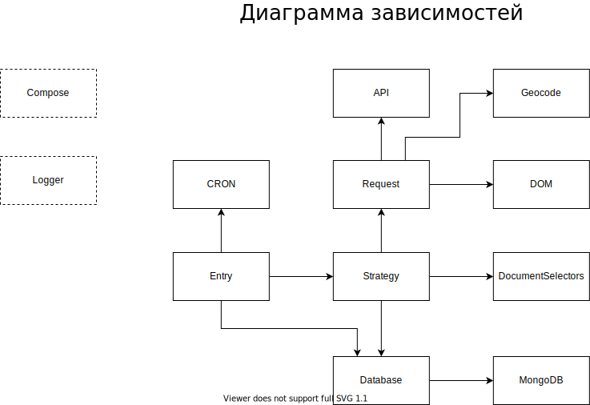

# Web Parser для сайта [onliner.rent](https://ak.api.onliner.by/search/apartments/)

Парсер собирает данные по аренде жилься с сайта onliner.rent, а так же с сайтов транспорта и метро.

## Установка

Необходимо устновить:
- [Node.js](https://nodejs.org/en/) - версия не ниже 12.16.1;
- [npm](https://nodejs.org/en/) - версия не ниже 6.13.1;
- [Docker](https://www.docker.com/products/docker-desktop) - версия не ниже 19.03.5.

После успешной установки всего вышеперечисленного, открываем консоль в текушей дирректории и пишем:
```sh
$ docker pull mongo
$ npm ci
```
Первой командой скачается образ монги, а второй скачаются **node_modules** по зависимостям из **package-lock**

## Запуск

Для запуска нужно запустить образ MongoDB:
```sh
$ docker run --name mongodb -d -p 27017:27017 mongo
```
Теперь вы можете проверить, что у вас появился контейнер MongoDB:
```sh
$ docker ps
```
Если контейнер появился то можно запускать парсер:
```sh
$ npm run dev
```
Парсер запущен, ура!

## Архитектура


